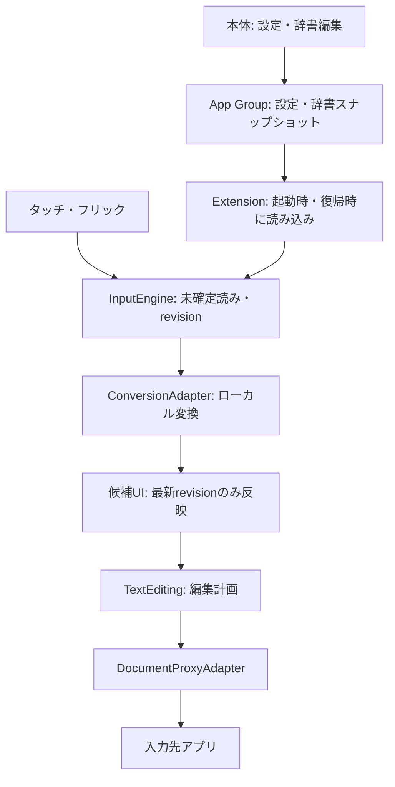

# アーキテクチャ設計

## 設計状態
以下の責務で初期ソースを作成。現状のファイル構成は [ルートARCHITECTURE](../ARCHITECTURE.md) を参照。iOS動作は未検証。
本体と拡張を分離し、固定版エンジン単体とSQLiteを使用する。権限・性能・ホスト互換性の採用判断は実機検証で確定する。

## ターゲットと責務
| ターゲット／論理領域 | 責務 | 依存 |
| --- | --- | --- |
| MyKeyboardApp（iOS App） | SwiftUI設定、辞書編集、導入・権限説明、将来の履歴管理 | Shared、Storage。辞書作成時に必要な場合のみConversion |
| MyKeyboardExtension | UIInputViewController、キーUI、フリック、候補、DocumentProxy操作 | Core、Storage、Shared、変換エンジン |
| Core（共有Swiftコード） | 入力状態、候補要求、編集計画。ホストAPIを直接呼ばない | Swift標準機能、変換アダプター |
| Storage / Shared | 保存と設定モデル、権限別の読み書き方針 | Foundation、SQLite等 |
| Unit / Integration / UI Tests | 純粋ロジック、保存、ホスト操作の検証 | 必要な対象のみ |

初期は2製品ターゲットとテストターゲットを基本とし、共有ソースのターゲット所属を明示する。
Coreのみ、Windowsからも独立テストできるよう依存なしのKeyboardCore Swift Packageにした。他の共有コードは対象ターゲットへ所属させる。拡張安全性はMacビルドで検査する。

## 全体データフロー


本体のプロセスが起動していなくても変換する。通信経路は設けない。

## 入力状態と編集境界
- 状態は idle / composing / candidates / committing を基本とし、読み、候補、カーソル、文書識別子、revisionを保持する。
- UIとDocumentProxyはメインスレッドで扱う。変換器の並行利用可否を確認し、候補計算は直列化して古い結果を破棄する。
- 変換アダプターがOSSのComposingText等を包み、UI側へOSS固有型を広げない。
- 初期実装は拡張内の未確定表示＋確定時挿入方式。marked text比較は実機環境で別途行う。既存ホストへ未検証の未確定範囲操作を先に組み込まない。
- 選択・文書・前後文脈が変わったら直前確定の再変換資格を失効させる。文字数の推測による無条件な削除はしない。
- スペースドラッグと文字挿入の競合、連続削除タイマーの取消を入力イベントとして管理する。

## ローカルストレージと権限
両製品に同じApp Group entitlementを付ける。IDは署名チーム決定後に確定する。
Appleの現行説明では、フルアクセスなしの拡張も共有コンテナを読み取れるが、共有書き込みは許可されない。[公式資料](https://developer.apple.com/documentation/uikit/configuring-open-access-for-a-custom-keyboard)

| データ | 所有者・保存先 | 書き込み方針 |
| --- | --- | --- |
| レイアウト・一般設定 | 本体、App Group UserDefaults | 本体が保存。拡張はスナップショットとして読み込む |
| テーマ・背景画像 | 本体、App Group Themes | 入力設定とは別の原子的JSONと縮小画像。拡張は表示時に読取。詳細は [UI/UX](10-UI-UX-AND-THEMES.md) |
| ユーザー辞書 | 本体、App Groupのバージョン付きファイル | 本体が原子的に公開。拡張は読み取り・変換器へ適用 |
| 標準変換辞書 | 拡張の同梱リソース | 実行中は変更しない |
| 学習 | 拡張、拡張自身のコンテナ | 本体との共有は初期必須にしない。エンジン既定形式を使い独自DBへ二重保存しない |
| 履歴（将来） | App Group内のSQLite | 本体が管理。拡張から保存・削除する場合はフルアクセス有効時のみ |

フルアクセスなしでは基本入力・変換・拡張内学習を維持する。共有設定の読取やエンジンの副作用は実機で確認し、失敗時は同梱既定値へ戻す。
UserDefaultsは一般設定に限る。辞書と履歴本文は保存しない。共有設定は起動・復帰時に再読込し、即時同期を前提にしない。

履歴モデル案: id、text、createdAt、lastUsedAt、pinned、textHash。本文の完全一致も確認して重複排除する。
SQLiteは短いトランザクション、プロセス別接続、busy_timeout 300ms、スキーマ版管理を実装。初期版はDELETE journalとsecure_deleteを使用する。WALは採用していない。
フルアクセスなしの共有読取には書込を必要としないスナップショットを使い、WAL副ファイルの作成を前提にしない。

機微データにファイル保護を適用し、DB・WAL・補助ファイルを含めて確認する。履歴・学習はバックアップ除外を検討し、OSバックアップとアプリ独自同期を区別する。
ロック中など保護データへアクセスできない場合は機能を無効化して入力を続ける。SQLite自体に暗号化を期待しない。追加暗号化・鍵共有は脅威モデルの結果で判断する。

## ディレクトリ
現在のルートを維持し、`my-keyboard-ios/` の二重ルートは作らない。実ファイルの検索入口は [CODEMAP](../CODEMAP.md)。下記は主な責務の構成。
```text
my-keyboard/
  MyKeyboard.xcodeproj
  App/{Settings,Dictionary,Onboarding}
  KeyboardExtension/{UI,Input,Layout}
  Core/{Conversion,InputEngine,TextEditing}
  Storage/{Preferences,Learning,Clipboard}
  Shared/
  Tests/{Unit,Integration,HostApp,UI}
  docs/
```
本体と拡張にそれぞれ子AGENTSを配置した。学習は拡張専用保存、履歴は完全一致本文のUNIQUE制約で重複排除し、初期版ではtextHashを持たない。
