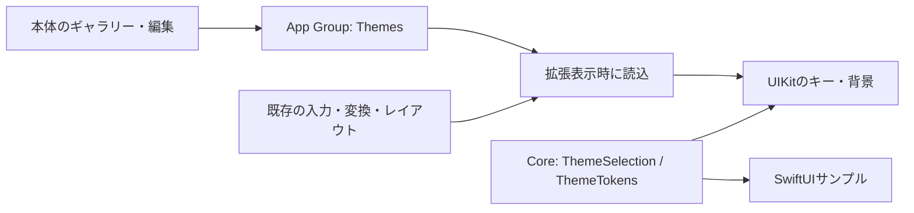

# UI/UXとテーマ設計

## 方針と調査
2026-10-08に [Living Aurora](https://github.com/maruyamamasaya/living-aurora-ui) の公開ソースを取得し、commit `1efef7fd0f10e906ef179224a762091b90749f6d` の `docs/DESIGN_SYSTEM.md`、`src/design-system/themes/index.ts`、`src/styles/themes.css` を確認した。
参照元には、光による階層、控えめな輪郭、表現と使いやすさの両立、用途ごとに表現量を変える考え方がある。Blue Cosmosは星・星雲・動きのある光を含む。
本アプリは、その思想から入力面を独自設計した。ソース、CSS、画像、フォントは転用せず、Web依存も追加していない。

## 決定事項
- 標準はBlue Cosmos。背景 `#050B24`、キー `#163967`、文字 `#F2F7FF`、アクセント `#70DEFF`。
- 標準キーは角丸14、シアンの枠線、小さい影。20pt/lightの主文字と9ptの方向ガイドを常時表示。上の光・下の陰影で凸面を示し、押下時にガイドと輪郭を強める。
- 英語キーは16pt/mediumのsystem rounded、技術記号は17pt/regularのmonospaced。日本語20pt/lightは維持。記号面の最上段は `://`・`@`・バッククオートで、フリックからURL接頭辞や補助記号を挿入できる。
- 背景は静的な光のグラデーションと最大24個の星。動画、ぼかしの重ね描画、常時アニメーション、ネットワーク資源を使用しない。
- 中央3列×4段のかな12キー、左列に記号/123/かな英字/絵文字、右列に削除/空白/下2段分の実行キー。上に候補と編集アイコン、地球キーも上のツールバーへ配置し、下部の独立行を撤去する。
- ツールバー右上に幅44pt・高さ36ptの下向き閉じるボタンを固定し、横スクロールしても残す。ライブ変換・単語再変換を確定してからキーボードを閉じる。
- 文字キー、暗い補助キー、枠なしツールバー、青い光沢・影を持つ実行キーで役割を区別する。背景は画面幅全体に描画し、外側の角丸カードを追加しない。
- 実行キーは入力先のreturnKeyTypeに応じた表示。未確定中は確定だけ行い、確定済みでは改行を挿入する（検索等の実行結果はホスト依存）。
- 濁点/小文字・フリック閾値・変換・連続削除・空白ドラッグ・カーソル操作は維持。絵文字は端末内の12個の固定候補。
- 上部は高さ68ptの固定領域。通常は読みの行を設けず、32ptの候補1行と36ptのツールバーを表示。予測開始・確定でキー位置を動かさない。上端余白4pt、上部内容は左右12pt内側へ配置する。
- 候補は14pt/light・1行・横スクロールで、背景・枠・影なし。既定は表示。旧版の表示設定は一度表示へ移行し、以後の明示設定を保存。本体設定で初期表示を保存、キーボードの目アイコンで一時切替。領域自体は固定し、キー位置を動かさない。
- 日本語の入力途中予測を同梱エンジンで有効化。予測候補はタップで確定、ライブ変換は読み全体の通常変換だけを反映し、語尾を自動補完しない。エラー時は候補行を一時的な状態メッセージに置換する。
- ライブ変換中の再変換は、エンジンの読み/表記が全文と一致する単語境界だけを使う。左右キーで対象単語を移動し、候補タップでその単語だけ更新、Enterで全体確定。未知の境界は1単位に扱い、推測で本文を切らない。
- 再変換中は候補を強制表示。確定後の本文再変換は従来の実験ゲートを維持する。
- コピー履歴画面はキー面へ重ねたスクロール領域。操作ボタン44ptと文字の内側余白・2行/縮小表示で、保存操作を縦方向に圧縮しない。
- 縦横とも高さ300pt・幅100%・中央配置・キー間隔3ptに固定。旧設定は読み取り互換のため保持するが表示へ適用しない。下端のiOS safe areaは維持する。
- カラーだけを編集可能。角丸14・不透明度0.8・枠線1.2・影0.24・星の背景は標準値へ固定し、過去のカスタム値も表示へ適用しない。Windows風プリセットは各プリセットの角丸・不透明度・枠・影・星なしを固定値として使う。
- Minimal Light、Minimal Darkも独自の静的プリセットとして同梱する。カスタム設定は現在選択中のテーマに対する1組。複数のカスタムテーマ名・履歴管理は将来拡張。
- Windows 3.1（紺/明灰）、95（くすんだ青緑/灰）、98（青緑/灰）、XP（空/丘/クリーム/緑）、Vista（青緑の光/濃いガラス）、Terminal（黒/緑の等幅文字）を同梱。合計12テーマ。XP/Vistaの背景画像もオフラインで同梱する。
- テーマ切替はプリセットへ戻し、現在の色編集を解除する。編集は保存を押して適用し、戻る操作で未保存の変更を破棄する。

## 責務と保存
| 場所 | 責務 |
| --- | --- |
| Core/Theme/ThemeTokens.swift | Foundationのみのトークン、プリセット、選択モデル、安全な値・画像名・コントラスト補正 |
| Storage/Preferences/ThemeStore.swift | App GroupのThemes/selection.json、UUID名の画像、原子的保存・読み取り・明示削除 |
| DesignSystem/Theme | UIKit/SwiftUIの色・キー・静的背景の描画、サイズを検査した画像の読込 |
| DesignSystem/Preview | 共通サンプルキーボード。指定向きの高さ・幅・間隔・配置を参照 |
| App/Theme | ギャラリー、編集、プレビュー、画像取込 |
| AppModel | 本体のテーマ状態管理と保存失敗通知。保存成功後に表示状態を更新 |
| KeyboardViewController | 開くときにテーマを読み、既存UIに適用。入力・変換状態とは分離 |

古い `KeyboardPreferences.theme` は互換性のため残す。新しいテーマJSONがない場合、system→Blue Cosmos、light→Minimal Light、dark→Minimal Darkへ移行する。他の入力設定は変更しない。
壊れたJSON・未知のスキーマ・共有読込失敗では既定へ戻す。未知のプリセットIDはBlue Cosmosの描画を使う。本体で変更したカラーはキーボードを開き直して反映する。使用中は閉じるボタンの上のパレットからプリセットを即時適用でき、入力・未確定状態は維持する。フルアクセス有効時だけ選択JSONへ保存し、無効時はcontroller内の一時選択にする。本体は再びアクティブになったときに保存済みカラーを読み直す。

## カラー編集と過去の画像
背景・キー・文字・アクセントの4色を変更できる。プリセットはカラーパレットとして使う。
背景画像・形状・透明度・影などの編集UIは撤去。以前保存した画像は削除せず、描画には使用しない。
画像取込と保存コードは過去データ互換のため残すが、現在の画面からは操作できない。

## アクセシビリティと画面
キーと文字の名目上のコントラスト比は4.5以上を目安に補正し、必要時は不透明なキーと白/黒文字へ切替える。背景上の文字・アクセントは別途補正する。3プリセットの静的な比率はPython検査済み。
高コントラスト時は輪郭を強め、影・背景装飾を抑える。透明度低減時は背景画像・星を隠し、キーを不透明にする。常時アニメーションがないためReduce Motionでも動きは発生しない。
テーマの明暗設定は端末の色モードと独立して選択する。標準のVoiceOver代替入力・キーボード切替・44pt以上の実キー制約を維持する。
本体のホームはカラーパレット一覧。タブはホーム・履歴・辞書・設定の順。編集・プレビュー・キーボード設定・使い方・アプリ情報は設定内へ集約する。本体の明暗は端末設定に従い、キーボードカラーの適用では変えない。アクセントは青に固定する。
プレビューはExtensionと同じUIKitのFlickButton・KeyboardActionButton、共通寸法KeyboardGeometryを使う300ptの静的サンプル。専用画面でかな/英語/記号を切り替える。入力・変換は実行せず、iOSの地球/音声フッターは含めない。

## 未検証・次のゲート
Swift型検査、SwiftUI/UIKit表示、App Groupsの反映、VoiceOver、文字拡大、連続入力の性能は未検証。
実際の描画コントラストと極端な色・画像・最小画面は実機で評価する。性能目標は実測後に決める。
[T-020〜023](07-TESTING-AND-ISSUES.md) と [Mac手順](08-MAC-VALIDATION.md) を参照する。

API参照: [ImageIOサムネイル](https://developer.apple.com/documentation/imageio/cgimagesourcecreatethumbnailatindex(_:_:_:))、[SwiftUIファイル選択](https://developer.apple.com/documentation/swiftui/view/fileimporter(ispresented:allowedcontenttypes:oncompletion:))。対象SDKでの署名・可用性・振る舞いの確認はMacビルド時に行う。

## 絵文字・記号一覧（2026-10-09）
[Simeji公式ガイド](https://simeji.me/guide)と[カテゴリ別一覧](https://simeji.me/kaomoji)の豊富な表現・カテゴリ選択を参考にした独自の一覧パネル。Simejiの画面そのものやランキングデータを複製していない。
- ☺キーから開く。記号は「記号」キー→コード用記号キーの「一覧」から開く。
- 絵文字/記号タブ、横スクロールのカテゴリ、縦スクロールの再利用セル。300ptの高さを維持。選択しても一覧に留まり連続入力できる。
- 絵文字: 表情、人/手（肌色違いも収録）、気持ち、動物/自然、食べ物、乗り物/場所、遊び/お祝い、道具/マーク。
- 記号: 句読点、括弧、星/ハート、矢印、数学/通貨、数字/単位、半角/コード。括弧ペア・URL等の複数文字もそのまま挿入。
- 最近使った項目は絵文字/記号を分けて各40件。controller生存中だけ保持し、ファイル保存・クラウド同期しない。空の一覧には案内を表示。
- 下部のかな/ABC/記号キーで入力配列へ戻れる。空白・削除も可能。地球キーと閉じるボタンは既存ツールバーに保持。
- 開く前に現在のライブ変換を既存の確定処理で確定。追加文字はtextDocumentProxyへ直接挿入。通信・フルアクセス・追加ライブラリは不要。
- 同梱Unicode文字のみ使用。全Unicode絵文字の網羅、語句検索、長押し肌色選択、顔文字ランキングは未実装。実機ホスト/VoiceOver操作は別途確認する。

## 上部ボタンの整理（2026-10-09）
- 左から「コピー」（既存のクリップボード履歴）・カーソル左・カーソル右・かな・カナ・ローマ字・再変換。未確定の読み、選択文字、未選択時はカーソル直前の単語を変換する。再変換の候補欄に取消を置き、候補選択まで本文は変更しない。英字配列の左列はカーソル右・☆123・縦2段のあA。必要時の地球キーはその後、閉じるボタンは右端。
- 上部の候補表示切替・あA・絵文字・記号一覧・確定・取消・単語削除を撤去。本体プレビューも合わせる。
- 候補表示は本体設定、確定は候補タップ/実行キー/空白/閉じる等の既存操作を使用。下部の配列切替と絵文字/記号一覧は利用可能。英語配列の左側は取消キーをあAへ置き換え、かなへ直接戻れるようにする。

漢字の読みは端末内の日本語単語解析による推定。同音・多読文字は正解を保証しない。選択範囲は128文字以内、未選択の直前単語は32文字以内で1文字がUTF-16の1単位に収まるもののみ。空白・句読点の後では単語直後へカーソルを戻す。

入力の感触: 文字確定、濁点/小文字の変更、絵文字/記号一覧の挿入、空白・実行キーにUIImpactFeedbackGeneratorのheavy/intensity 1.0を1回返す。フリック移動/取消や空白ドラッグは対象外。本体設定でON/OFF、既存設定への追加時もON。実際の振動は端末とアクセス権に依存する。

iOS17.5以降の振動Generatorは表示中のキーボードviewへ接続し、再表示時に生成し直す。本体の「振動を試す」で端末側を切り分けられる。フルアクセス設定の案内も表示する。

本体UI: キャッチコピーや常設の機能説明を撤去。ホームはカラーパレット一覧を直接表示。下部タブはホーム・履歴・辞書・設定。設定メニュー内にキーボード設定/プレビュー/使い方/カラーパレット/カラー編集/プライバシー・アプリ情報を置く。入力設定は専用画面にまとめ、振動トラブルの案内は折りたたむ。

## Windowsデスクトップの表現
- 98は青緑のディザ背景、灰色の四角いキー、白/濃灰の立体枠。XPは青空と丘の低解像度背景、クリーム色のキー、緑の実行キー。
- Vistaは暗い青緑のグラデーションと光の曲線、ガラス風のキー。XP/Vistaは生成した1448×1086の同梱背景を高品質補間で表示する。3.1/95/98/Terminalの手続き描画は160×120のまま。ネットワーク・外部フォント依存なし。
- 3.1/95/98/Terminalは等幅の中太文字、XP/Vistaはシステムの中太文字を使う。XP/Vistaは細い枠と共通の光沢で文字キーと操作キーを揃える。上部は柔らかい暗色グラデーションで候補とツールバーの可読性を確保する。
- `desktopStyle`はプリセットから固定する。旧JSONにない場合も選択IDから復元し、カスタム色の保存で失われない。透明度低減/コントラスト増強時は背景装飾を省略する。

画像と生成プロンプトの正本は [背景素材](theme-wallpapers.md)。カスタム背景色は画像へ色相ブレンドとして反映し、キー・文字・アクセント色は従来どおり変更可能。素材欠落時は手続き描画へ戻る。

XPのキー面は深いクリーム色 `#DDD8C4`、Vistaは濃い青緑 `#193442`。全パレット共通の不透明度0.8で背景をうっすら透かし、白い光沢の最大値をXP0.18/Vista0.14へ抑える。

全12パレットの文字キー・操作キー・実行キーは不透明度0.8。文字・アイコンは透かさず、キー面だけへ適用する。コントラスト補正/アクセシビリティ時は不透明に戻す。

## 夜空と90年代・Terminal
- Blue Cosmosは青みの深い夜空、180個の大小の星、青い光のにじみ。配置は固定し、入力時に動かさない。
- Windows 3.1/95/98はCourier系文字と日本語フォールバックを1pt単位でラスタライズし、文字にドット感を付ける。立体枠と四角いキーを維持。
- Terminalは黒地/緑の等幅文字、薄い走査線、細い緑枠、光沢なし。キー面は共通の80%。
- Living Aurora/Pulse Neon/Windows 7は廃止。保存済み選択IDは読込時にBlue Cosmosへ移行し、ユーザーのカスタム色と画像参照は保持する。

## 携帯ゲーム機・16bitゲーム機
- Game Boy: グレー/緑/バーガンディ、ドット感の文字、オリーブ色の基板背景。
- Game Boy Color Violet: 少し淡いバイオレット、透明樹脂越しの基板、ラベンダーの光沢。
- Super Famicom: グレーのキーと4色の操作面（青/記号、黄/123、緑/あA、赤/絵文字）。実行キーはアクセント色。
- 基板は厳密な実機再現ではないオリジナル画像。各1448×1086、オフライン同梱。不透明度80%、文字/アイコンは不透明。
- 原画像とプロンプトは [基板素材](console-board-assets.md)。キーと部品背景を本体/拡張の共通描画で重ねる。

### ゲーム機の外装配色版

基板版を残し、Shell版を別プリセットとして追加。Game Boyはグレー外装・オリーブの液晶色・チャコール操作・えんじの実行キー。Color Violetは淡い紫外装・チャコールキー。Super Famicomはライトグレー外装・白灰キー・4色操作。背景は生成した高解像度の樹脂素材画像で、キー不透明度80%を維持。厳密な実機色の再現ではない。
