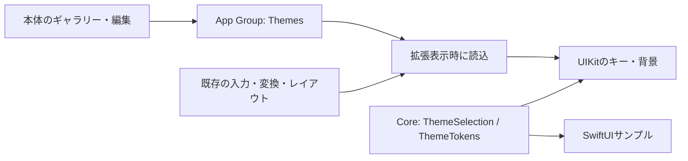

# UI/UXとテーマ設計

## 方針と調査
2026-10-08に [Living Aurora](https://github.com/maruyamamasaya/living-aurora-ui) の公開ソースを取得し、commit `1efef7fd0f10e906ef179224a762091b90749f6d` の `docs/DESIGN_SYSTEM.md`、`src/design-system/themes/index.ts`、`src/styles/themes.css` を確認した。
参照元には、光による階層、控えめな輪郭、表現と使いやすさの両立、用途ごとに表現量を変える考え方がある。Blue Cosmosは星・星雲・動きのある光を含む。
本アプリは、その思想から入力面を独自設計した。ソース、CSS、画像、フォントは転用せず、Web依存も追加していない。

## 決定事項
- 標準はBlue Cosmos。背景 `#080F26`、キー `#203D68`、文字 `#F2F7FF`、アクセント `#70DEFF`。
- 標準キーは角丸14、シアンの枠線、小さい影。20pt/lightの主文字と9ptの方向ガイドを常時表示。上の光・下の陰影で凸面を示し、押下時にガイドと輪郭を強める。
- 背景は静的な光のグラデーションと最大24個の星。動画、ぼかしの重ね描画、常時アニメーション、ネットワーク資源を使用しない。
- 中央3列×4段のかな12キー、左列に記号/123/かな英字/絵文字、右列に削除/空白/下2段分の実行キー。上に候補と編集アイコン、地球キーも上のツールバーへ配置し、下部の独立行を撤去する。
- ツールバー右上に幅44pt・高さ36ptの下向き閉じるボタンを固定し、横スクロールしても残す。ライブ変換・単語再変換を確定してからキーボードを閉じる。
- 文字キー、暗い補助キー、枠なしツールバー、青い光沢・影を持つ実行キーで役割を区別する。背景は画面幅全体に描画し、外側の角丸カードを追加しない。
- 実行キーは入力先のreturnKeyTypeに応じた表示。未確定中は確定だけ行い、確定済みでは改行を挿入する（検索等の実行結果はホスト依存）。
- 濁点/小文字・フリック閾値・変換・連続削除・空白ドラッグ・カーソル操作は維持。絵文字は端末内の12個の固定候補。
- 上部は高さ68ptの固定領域。通常は読みの行を設けず、32ptの候補1行と36ptのツールバーを表示。予測開始・確定でキー位置を動かさない。上端余白4pt、上部内容は左右12pt内側へ配置する。
- 候補は14pt/light・1行・横スクロールで、背景・枠・影なし。既定は表示。旧版の表示設定は一度表示へ移行し、以後の明示設定を保存。本体設定で初期表示を保存、キーボードの目アイコンで一時切替。領域自体は固定し、キー位置を動かさない。
- 日本語の入力途中予測を同梱エンジンで有効化。予測候補はタップで確定、ライブ変換は読み全体の通常変換だけを反映し、語尾を自動補完しない。エラー時は候補行を一時的な状態メッセージに置換する。
- ライブ変換中の再変換は、エンジンの読み/表記が全文と一致する単語境界だけを使う。左右キーで対象単語を移動し、候補タップでその単語だけ更新、Enterで全体確定。未知の境界は1単位に扱い、推測で本文を切らない。
- 再変換中は候補を強制表示。確定後の本文再変換は従来の実験ゲートを維持する。
- コピー履歴画面はキー面へ重ねたスクロール領域。操作ボタン44ptと文字の内側余白・2行/縮小表示で、保存操作を縦方向に圧縮しない。
- 縦横とも高さ300pt・幅100%・中央配置・キー間隔3ptに固定。旧設定は読み取り互換のため保持するが表示へ適用しない。下端のiOS safe areaは維持する。
- カラーだけを編集可能。角丸14・不透明度0.94・枠線1.2・影0.24・星の背景は標準値へ固定し、過去のカスタム値も表示へ適用しない。
- Minimal Light、Minimal Dark、Living Aurora、Pulse Neonも独自の静的プリセットとして同梱する。カスタム設定は現在選択中のテーマに対する1組。複数のカスタムテーマ名・履歴管理は将来拡張。
- テーマ切替はプリセットへ戻し、現在の色編集を解除する。編集は保存を押して適用し、戻る操作で未保存の変更を破棄する。

## 責務と保存
| 場所 | 責務 |
| --- | --- |
| Core/Theme/ThemeTokens.swift | Foundationのみのトークン、プリセット、選択モデル、安全な値・画像名・コントラスト補正 |
| Storage/Preferences/ThemeStore.swift | App GroupのThemes/selection.json、UUID名の画像、原子的保存・読み取り・明示削除 |
| DesignSystem/Theme | UIKit/SwiftUIの色・キー・静的背景の描画、サイズを検査した画像の読込 |
| DesignSystem/Preview | 共通サンプルキーボード。指定向きの高さ・幅・間隔・配置を参照 |
| App/Theme | ギャラリー、編集、プレビュー、ダッシュボード、画像取込 |
| AppModel | 本体のテーマ状態管理と保存失敗通知。保存成功後に表示状態を更新 |
| KeyboardViewController | 開くときにテーマを読み、既存UIに適用。入力・変換状態とは分離 |

古い `KeyboardPreferences.theme` は互換性のため残す。新しいテーマJSONがない場合、system→Blue Cosmos、light→Minimal Light、dark→Minimal Darkへ移行する。他の入力設定は変更しない。
壊れたJSON・未知のスキーマ・共有読込失敗では既定へ戻す。未知のプリセットIDはBlue Cosmosの描画を使う。即時同期は前提にせず、キーボードを開き直して反映する。

## カラー編集と過去の画像
背景・キー・文字・アクセントの4色を変更できる。プリセットはカラーパレットとして使う。
背景画像・形状・透明度・影などの編集UIは撤去。以前保存した画像は削除せず、描画には使用しない。
画像取込と保存コードは過去データ互換のため残すが、現在の画面からは操作できない。

## アクセシビリティと画面
キーと文字の名目上のコントラスト比は4.5以上を目安に補正し、必要時は不透明なキーと白/黒文字へ切替える。背景上の文字・アクセントは別途補正する。5プリセットの静的な比率はPython検査済み。
高コントラスト時は輪郭を強め、影・背景装飾を抑える。透明度低減時は背景画像・星を隠し、キーを不透明にする。常時アニメーションがないためReduce Motionでも動きは発生しない。
テーマの明暗設定は端末の色モードと独立して選択する。標準のVoiceOver代替入力・キーボード切替・44pt以上の実キー制約を維持する。
本体はホームからテーマ・編集・プレビュー・設定・使い方/プライバシー/情報へ移動し、辞書と手動履歴の既存画面をタブから利用する。
プレビューは共通トークンとレイアウト設定を使う静的サンプル。変換、フリック、実機の高さ制約を再現するシミュレーターではない。

## 未検証・次のゲート
Swift型検査、SwiftUI/UIKit表示、App Groupsの反映、VoiceOver、文字拡大、連続入力の性能は未検証。
実際の描画コントラストと極端な色・画像・最小画面は実機で評価する。性能目標は実測後に決める。
[T-020〜023](07-TESTING-AND-ISSUES.md) と [Mac手順](08-MAC-VALIDATION.md) を参照する。

API参照: [ImageIOサムネイル](https://developer.apple.com/documentation/imageio/cgimagesourcecreatethumbnailatindex(_:_:_:))、[SwiftUIファイル選択](https://developer.apple.com/documentation/swiftui/view/fileimporter(ispresented:allowedcontenttypes:oncompletion:))。対象SDKでの署名・可用性・振る舞いの確認はMacビルド時に行う。
