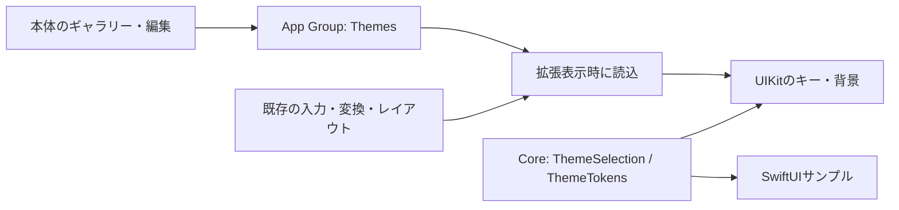

# UI/UXとテーマ設計

## 方針と調査
2026-10-08に [Living Aurora](https://github.com/maruyamamasaya/living-aurora-ui) の公開ソースを取得し、commit `1efef7fd0f10e906ef179224a762091b90749f6d` の `docs/DESIGN_SYSTEM.md`、`src/design-system/themes/index.ts`、`src/styles/themes.css` を確認した。
参照元には、光による階層、控えめな輪郭、表現と使いやすさの両立、用途ごとに表現量を変える考え方がある。Blue Cosmosは星・星雲・動きのある光を含む。
本アプリは、その思想から入力面を独自設計した。ソース、CSS、画像、フォントは転用せず、Web依存も追加していない。

## 決定事項
- 標準はBlue Cosmos。背景 `#081426`、キー `#20364F`、文字 `#F2F7FF`、アクセント `#9CD7FF`。
- キーは角丸10、薄い枠線、小さい影。輪郭の即時変化で押下を示し、フリック中だけ方向の文字ガイドを表示する。
- 背景は最大24個の静的な星。動画、ぼかしの重ね描画、常時アニメーション、ネットワーク資源を使用しない。
- かな12キーの配置・判定閾値・入力先への挿入・変換・削除・カーソル操作は既存処理を維持する。
- テーマ選択はレイアウトと別の設定。縦横の高さ・幅・間隔・左右配置に影響しない。
- Minimal Light、Minimal Dark、Living Aurora、Pulse Neonも独自の静的プリセットとして同梱する。カスタム設定は現在選択中のテーマに対する1組。複数のカスタムテーマ名・履歴管理は将来拡張。
- テーマ切替はプリセットへ戻し、現在の色編集・画像選択を解除する。編集は保存を押して適用し、戻る操作で未保存の変更を破棄する。

## 責務と保存
| 場所 | 責務 |
| --- | --- |
| Core/Theme/ThemeTokens.swift | Foundationのみのトークン、プリセット、選択モデル、安全な値・画像名・コントラスト補正 |
| Storage/Preferences/ThemeStore.swift | App GroupのThemes/selection.json、UUID名の画像、原子的保存・読み取り・明示削除 |
| DesignSystem/Theme | UIKit/SwiftUIの色・キー・静的背景の描画、サイズを検査した画像の読込 |
| DesignSystem/Preview | 共通サンプルキーボード。指定向きの高さ・幅・間隔・配置を参照 |
| App/Theme | ギャラリー、編集、プレビュー、ダッシュボード、画像取込 |
| AppModel | 本体のテーマ状態管理と保存失敗通知。保存成功後に表示状態を更新 |
| KeyboardViewController | 開くときにテーマを読み、既存UIに適用。入力・変換状態とは分離 |

古い `KeyboardPreferences.theme` は互換性のため残す。新しいテーマJSONがない場合、system→Blue Cosmos、light→Minimal Light、dark→Minimal Darkへ移行する。他の入力設定は変更しない。
壊れたJSON・未知のスキーマ・共有読込失敗では既定へ戻す。未知のプリセットIDはBlue Cosmosの描画を使う。即時同期は前提にせず、キーボードを開き直して反映する。

## 画像とオフライン
端末内のファイルをユーザーが明示選択する。アプリはダウンロードAPIを持たず、iCloud上で未取得の画像は拒否する。ファイル選択画面の外部プロバイダーはOS側の機能なので、通信を完全に避ける試験では「このiPhone内」の取得済み画像を使用する。
取込は別タスクで処理し、20MB・4000万画素以下の静止画像だけ受け付ける。ImageIOで長辺1024px以下に縮小し、1MB以下のJPEGに再エンコードする。元のメタデータは引き継がない。
拡張の読込時もファイルサイズ・画素寸法を検査する。画像を22%で合成し、キーは不透明にする。メモリ警告で背景画像を解放し、次回表示で再読込する。
画像は最大20ファイル。未使用画像は本体の明示操作で削除できる。保存失敗時の孤立画像も対象。別プロセスが保持する旧画像に配慮し、テーマ変更のたびに自動削除しない。
共有ディレクトリにファイル保護・バックアップ除外を設定する。実ファイルへの継承とロック時の挙動はT-021で検証する。

## アクセシビリティと画面
キーと文字の名目上のコントラスト比は4.5以上を目安に補正し、必要時は不透明なキーと白/黒文字へ切替える。背景上の文字・アクセントは別途補正する。5プリセットの静的な比率はPython検査済み。
高コントラスト時は輪郭を強め、影・背景装飾を抑える。透明度低減時は背景画像・星を隠し、キーを不透明にする。常時アニメーションがないためReduce Motionでも動きは発生しない。
テーマの明暗設定は端末の色モードと独立して選択する。標準のVoiceOver代替入力・キーボード切替・44pt以上の実キー制約を維持する。
本体はホームからテーマ・編集・プレビュー・設定・使い方/プライバシー/情報へ移動し、辞書と手動履歴の既存画面をタブから利用する。
プレビューは共通トークンとレイアウト設定を使う静的サンプル。変換、フリック、実機の高さ制約を再現するシミュレーターではない。

## 未検証・次のゲート
Swift型検査、SwiftUI/UIKit表示、写真取込とOSの許可、App Groupsの反映、VoiceOver、文字拡大、連続入力の性能は未検証。
実際の描画コントラストと極端な色・画像・最小画面は実機で評価する。性能目標は実測後に決める。
[T-020〜023](07-TESTING-AND-ISSUES.md) と [Mac手順](08-MAC-VALIDATION.md) を参照する。

API参照: [ImageIOサムネイル](https://developer.apple.com/documentation/imageio/cgimagesourcecreatethumbnailatindex(_:_:_:))、[SwiftUIファイル選択](https://developer.apple.com/documentation/swiftui/view/fileimporter(ispresented:allowedcontenttypes:oncompletion:))。対象SDKでの署名・可用性・振る舞いの確認はMacビルド時に行う。
