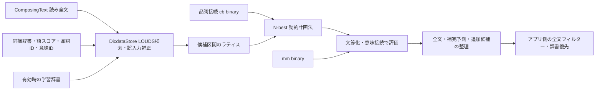
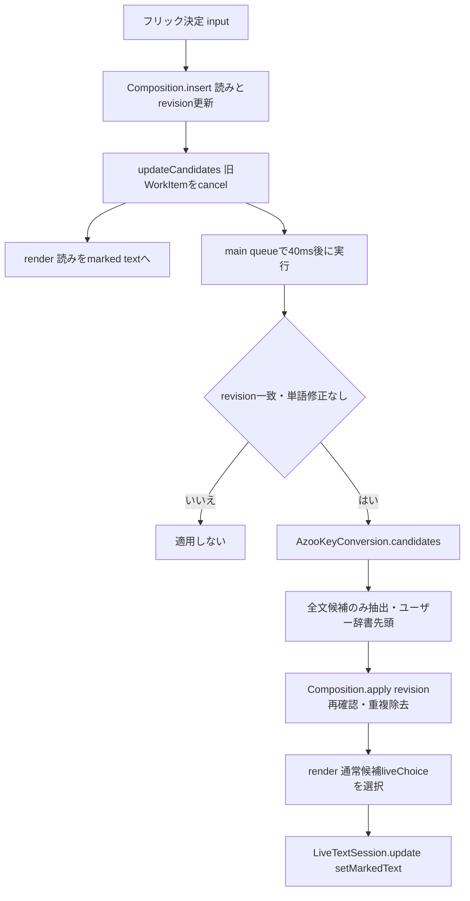
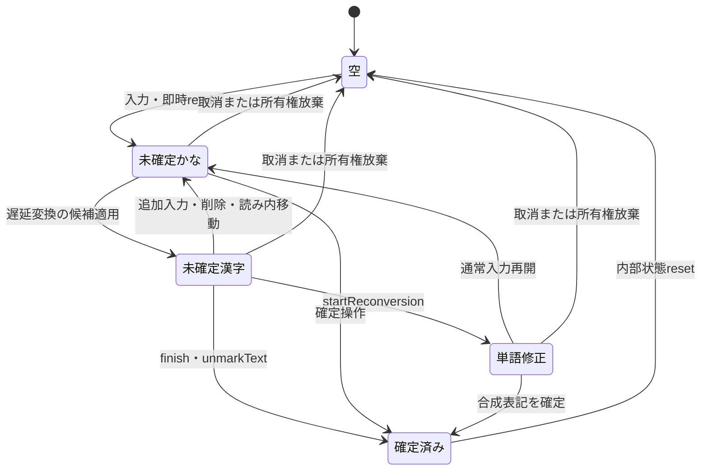
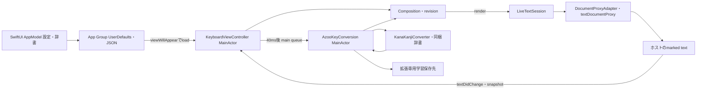

# 日本語ライブ変換の実装アーキテクチャ

## 1. 概要
調査日: 2026-10-09。対象はアプリcommit `22fa0be314675d0015657f03fc45a2335853ab39` とSPM固定版。ソース変更・実機計測は実施していない。本人の実機評価「精度・操作感が良好」と、コードから確認できる仕組みを区別する。以下の行番号は調査時点のもの。従来の設計文書の「ライブ変換を初期必須にしない」「Package.resolved未生成」は過去の状態であり、本書は現実装を説明する。

## 2. ライブ変換とは
一般には、入力中の読みから候補を求め、確定操作を待たず表記を更新する方式。本アプリは読みを内部に保持し、入力先のmarked text（未確定領域）を通常変換の最上位候補へ更新する。候補の自動表示と確定は別操作。補完予測を本文に自動採用する方式ではない。

## 3. 現在のアプリの実装構成
| 責務 | 実装・確認箇所 |
| --- | --- |
| キー・候補・ライフサイクル | [KeyboardViewController.swift](../KeyboardExtension/KeyboardViewController.swift) `KeyboardViewController: UIInputViewController`、`input` L407、`updateCandidates` L417、`render` L431 |
| 読み・カーソル・版管理 | [Composition.swift](../Core/InputEngine/Composition.swift) `Composition` L13、`liveChoice` L18、`changed` L22、`apply` L52 |
| 変換器との境界 | [AzooKeyConversion.swift](../KeyboardExtension/Input/AzooKeyConversion.swift) `AzooKeyConversion` L6、`candidates` L21、`commit` L59 |
| 未確定領域の所有権 | [LiveTextSession.swift](../Core/InputEngine/LiveTextSession.swift) `update` L16、`finish` L24、`cancel` L30 |
| UIKit・入力先情報 | [DocumentProxyAdapter.swift](../KeyboardExtension/Input/DocumentProxyAdapter.swift) L5–13、[DocumentIdentity.swift](../Shared/DocumentIdentity.swift) L4–11 |
| 単語修正・共有辞書 | [WordReconversion.swift](../Core/InputEngine/WordReconversion.swift) L10–34、[UserDictionaryStore.swift](../Storage/Dictionary/UserDictionaryStore.swift) L3–34 |
本体はSwiftUIの設定画面、ExtensionはUIKitの入力画面。辞書検索・経路探索はOSS、表示候補の制限・完全一致ユーザー辞書の優先・debounce・marked textの安全管理は独自実装。

## 4. 使用している変換エンジン
**AzooKeyKanaKanjiConverter v0.8.5**、revision `8278b6b76e534f1a08e4db2a11602f499d754327`。`KanaKanjiConverterModuleWithDefaultDictionary`をimportし、`KanaKanjiConverter()`と`ConvertRequestOptions.withDefaultDictionary`を使用する。[Package.resolved](../MyKeyboard.xcodeproj/project.xcworkspace/xcshareddata/swiftpm/Package.resolved)、[生成設定](../scripts/generate_project.py) L9、取得済み依存checkoutのHEADが一致。固定版[Package.swift](https://github.com/azooKey/AzooKeyKanaKanjiConverter/blob/8278b6b76e534f1a08e4db2a11602f499d754327/Package.swift)が上流の正本。
SPM解決記録の推移依存はJinja 1.1.2、swift-algorithms 1.2.1、swift-collections 1.7.2、swift-numerics 1.1.1、swift-tokenizers 0.0.1。依存の存在は各機能の実行を意味しない。ニューラルtraitは設定されず、`withDefaultDictionary` L20の`zenzaiMode = .off`を上書きしないため、Zenzaiのニューラル推論とEfficientNGramによるニューラル個人化経路は使用しない。
変換は同梱辞書・ローカル学習ファイルで完結。アプリの変換経路にネットワークAPI呼出しはない。開発時のSPM取得通信とは別。`RequestsOpenAccess = true`は[Extension plist](../Config/MyKeyboardExtension-Info.plist)の権限要求であり、変換が通信・フルアクセスに依存するという意味ではない。実行時パケット捕捉は未実施。

## 5. 辞書と変換アルゴリズム
標準辞書は`azooKey_dictionary_storage` commit `7ed1c6b3e361e9f453d23beefa344422f4027eb1`、絵文字資源は`ec11764a92fa044cd7d497b8b7d67e966c054a6f`。[OSS表示](../Resources/ThirdPartyNotices.txt)に版とライセンスを収録。ローカルcheckoutの`.gitmodules`/gitlinkと資源を確認できる版を対象とし、辞書の学習元コーパス・個々の語の採録由来は未確認。
固定版の`Sources/KanaKanjiConverterModuleWithDefaultDictionary/KanaKanjiConverterModuleWithDefaultDictionary.swift` L25–29が`Bundle.module/Dictionary`を指定。読みの索引はLOUDS trieの`.louds`、文字IDは`.loudschars2`と`charID.chid`、語データは`.loudstxt3`。`LOUDS/extension LOUDS.swift` L75–100は語数UInt16、左右品詞ID・意味ID各UInt16、Float32スコア、タブ区切りUTF-8の読み・表記を復号する。品詞接続は`cb/<右品詞ID>.binary`（Int32/Float）、意味接続は`mm.binary`。これらは汎用CSV辞書ではなくエンジン専用バイナリ資源。
`DicdataElement`は`word/ruby/lcid/rcid/mid/baseValue/adjust`を持つ。`Kana2Kanji/all.swift` L32–93で各入力位置に辞書語のノードを作り、読みの区間を覆うラティス上を動的計画法で探索する。単語分割と候補選択を同時に行う形態素解析に相当する処理であり、アプリが別途MeCab等を呼ぶ構成ではない。`DocumentProxyAdapter`のCFStringTokenizerは実験的な確定済み語削除用で、ライブ変換の解析器ではない。
ノードの語スコアと品詞接続スコアを加算し、各接続先で上位`N_best = 10`経路を保持する（Viterbi型のN-best探索、とコードの計算構造から分類）。スコアは大きいほど上位で、一般的な「コスト最小化」と符号の説明が異なる。`Kana2Kanji/Kana2Kanji.swift` L27–44は文節候補に意味ID間の接続スコアを追加する。品詞接続による探索後の候補に意味接続を加えるため、全経路を意味込みで厳密最適化するという説明はしない。

通常の品詞・意味接続は隣接クラス間の統計スコアであり、一般的なN-gramの考え方と関連する。ただし通常変換で独立した単語/文字N-gram言語モデルを読み込む設定はない。**N-gramを全く使わない**とも断定できず、有効時の学習には文節bigramが実装されている。一般論のニューラル言語モデルによる長距離意味理解は今回の実装事実ではない。

## 6. ライブ変換の処理フロー
かなフリックの決定は`FlickButton.onCommit`から`input`へ渡る（controller L353–356）。挿入・削除・濁点/小文字変更・未確定内カーソル移動で`updateCandidates`を呼ぶ。読み変更で`revision`を増やし候補を消すため、最初の`render`は原則かなを表示する。その後40ms待って最新の読みの変換を実行し、再描画で漢字へ置換する。再表示時も読みがあれば更新要求する。

アプリは毎回新しい`ComposingText`に未確定の**読み全文**を`.direct`で入れる。ホストの確定済み全文は渡さない。全文を渡すことと毎回ゼロから全文を計算することは別で、持続する`KanaKanjiConverter`が`previousInputData/nodes`を保持する。上流`Converter/KanaKanjiConverter.swift` L605–691は無変更・末尾追加・末尾削除・末尾差し替えの専用計算を選択し、初回/該当しないケースは全計算する。アプリ独自の結果キャッシュはない。確定/取消時は`stopComposition`で経路キャッシュをリセットする。
`requestCandidates`の`mainResults`から`inputable && correspondingCount == input.input.count && actions.isEmpty`のみ最大10件を保持。`N_best=10`は探索中の経路数で、最終10候補の保証ではない。上流`processResult` L477–596は全文上位5件・日本語補完予測最大3件・追加候補をスコアで混ぜ、文節/単語候補等も続ける。アプリは上流順を保持し、完全一致の独自辞書→OSS→読み→カタカナの順で重複表記を除去する。
`isPrediction`は語データの読みをひらがな化して連結したものと入力読みの不一致で判定する。したがって補完だけでなく誤入力補正候補も不一致ならライブ採用から除かれる。`liveChoice`は最初の非予測候補を選ぶ。候補欄の表示/非表示はこの処理を停止せず、予測候補をタップした場合はその候補を確定できる。

## 7. 文脈に応じた漢字変換の仕組み
同音異義語は、同じ読みを持つ複数の辞書語、分割候補、語スコア、品詞接続、文節意味接続、設定を有効にした場合の学習語を組み合わせて順位付けする。「せいど」だけで決めず、現在の未確定読みの前後を含む経路を比較できる。意味IDは統計的な分類IDであり、文意を人間のように理解する仕組みとは異なる。
| 入力例 | 機構上の説明と確認範囲 |
| --- | --- |
| へんかんのせいど →「変換の精度」 | 「変換/の/精度」等の分割・接続を全文として評価しうる。精度/制度の実際の語ID・寄与点・最上位結果は未確認 |
| かいしゃのせいど →「会社の制度」 | 同じ「せいど」でも前半を含む候補スコアが変わりうる。制度になる保証・前例との順位差は未確認 |
| ようけんていぎをおこなう →「要件定義を行う」 | 語候補と助詞/動詞の接続を組み合わせる。「要件定義」が1辞書語か複数語か、実際の候補境界は未確認 |
| しょうがいのげんいんをちょうさする →「障害の原因を調査する」 | 障害/生涯などの語と後続部分を含む経路比較が可能。実際の選択根拠・正解順位は未確認 |
これらは説明用の期待表記であり、本調査で4例の変換実行・候補スコア分解は行っていない。辞書コストと接続IDが同じ候補は、説明した接続機構だけで区別できるとは限らない。ユーザーの良好な実機評価は尊重するが、特定例の正解理由を未取得の数値から説明しない。
学習は[KeyboardPreferences](../Core/Layout/LayoutPreferences.swift) L22/38で**既定無効**。有効・保存先利用可能・OSS tokenがある候補の確定成功時のみ`updateLearningData`と`.closeKeyboard`を実行。拡張専用`Application Support/ConversionLearning`へ保存し、最大保持件数設定は4096（メモリのbyte上限ではない）。上流`DicdataStore/LearningMemory.swift` L735–844は単語・文節bigram・全文を記憶し、L101–106は頻度と読み長から学習語スコアを計算する。学習はニューラルモデルの再訓練ではない。`learningResetID`変更時はadapter L23–35で変換器を再生成し、所有する学習ディレクトリだけを削除・再作成する。保存先準備失敗時は`learningAvailable = false`として学習なしの変換を継続する。
独自辞書は共有`dictionary-v1.json`（version/id/reading/text、最大1000件）で、読み全文が完全一致すると先頭へ差し込む。OSSラティスへ動的登録していないため、登録語を長い文中で自動利用する仕組みはない。独自辞書・読みfallback・単語修正後の合成確定にはtokenがなく、OSS学習対象にならない。確定直後のresetは上流の`lastData`も消すため、連続する確定単位をまたいだ直前語の学習文脈を維持しない。ホストの前後文脈は安全確認用であり変換エンジンへの文脈入力ではない。

## 8. 未確定文字列・確定文字列の管理
`Composition`はSwift Character単位の読み・カーソル・revisionを保持し、最大128文字を超える挿入を拒否する。marked textの選択位置はUTF-16へ換算。読み内の途中編集では漢字候補でなくかな全文を表示する。`WordReconversion`はOSS語データの読み/表記連結が全文と一致するときだけ分割を利用し、不一致なら全体1単位にする。選択語の候補を予測無効で再取得し表記を差し替え、合成確定は元tokenを使わず誤学習を避ける。

確定はcontroller `commit` L475–491→`LiveTextSession.finish`でmarked textを選択表記に更新して`unmarkText`する（二重insertしない）。未確定領域がない場合は`insertText`。確定ボタン、候補タップ、空白、実行キー、内部配列切替、閉じる/非表示で確定する。変換待機中の確定は同期的に最新変換を待たず、その時点の`liveChoice`（候補が消えていれば読み）を確定する。
所有権は文書IDとbefore/after/selectedの`DocumentSnapshot`で照合する。ID不明、外部編集、入力先変更で不一致なら放棄して内部状態を消す。この放棄はホスト本文を消す取消と異なる。安全に一致する取消だけ空のmarked textとunmarkで未確定領域を消す。確定済み再変換は`EnableExperimentalHostReplacement`の実験ゲートにあり既定無効。

## 9. iOS Keyboard Extensionとの連携
Extensionのprincipal classは`KeyboardViewController`、extension pointは`com.apple.keyboard-service`。地球キーは`handleInputModeList(from:with:)`を使用。`textDocumentProxy`のmarked更新・確定、直接入力/削除、位置移動と前後文脈の取得はUIKit境界に置く。`DocumentIdentity.read`はnullableなObjective-C値を確認してからUUIDへ橋渡しし、ID欠落を安全に扱う。

SwiftUIの`AppModel: ObservableObject`とExtensionのCompositionを直接Binding同期する処理はない。本体が設定/辞書を保存しExtensionが`viewWillAppear` L201–213で読み直す。変換・DocumentProxy・UIはMainActor/メインスレッド。DispatchWorkItemによる遅延実行は非同期スケジュールで、エンジン計算そのものは同期処理。別actorやバックグラウンド変換Taskはない。
`viewWillDisappear` L221–226で確定、WorkItem/削除Timer停止、取消、変換器close。再表示は設定・辞書をロードし既存converterを再利用できるが、未確定読みを永続保存して復元する機能はない。同じcontrollerの内部配列modeは保持、再生成時は0（かな）から開始。`didReceiveMemoryWarning` L235–240は変換器解放・辞書/入力状態消去を行う。OS強制終了時の確定や復元は保証されず未確認。

## 10. パフォーマンスと最適化
| 項目 | コードから確認できる事実／実測状態 |
| --- | --- |
| 実行頻度 | 入力イベントごとに要求、旧WorkItem取消、40ms debounce。名目上は待機内の連続入力をまとめるが実行回数/秒は未計測。単語修正は待機せず同期要求 |
| 時間計測 | `lastLatencyMilliseconds`（adapter L12/39–52）はsystemUptime差分。options生成・request・全文フィルターを含むが、40ms待機、ComposingText構築、独自辞書処理、UI/marked更新を含まない。実機値・中央値・p95・冷起動は未計測 |
| メモリ | エンジンの読み/nodes、候補data、LOUDS・接続表cache、学習trie等を保持。常駐量/ピーク/Extension終了閾値は未計測。4096は学習件数でメモリ上限ではない |
| 長文 | 未確定128文字まで。辞書語の分岐と経路保持が増えるため負荷増の可能性は構造上あるが、長さ別時間/メモリは未計測。ホスト確定済み全文は再変換しない |
| 差分・cache | 上流の入力差分/nodes再利用、LOUDS辞書cache、品詞接続表の遅延ロード/保持。`preloadDictionary`は既定false。実際の差分経路割合/ヒット率は未計測 |
| 揺れ | 後続読みによる経路/順位変更、即時かな→遅延漢字、途中カーソルでかな表示、独自辞書完全一致の成立/不成立、単語修正で表記変更。揺れ率は未計測。順位固定・ヒステリシスは未実装 |
| 不要な要求 | renderは同じ表記でもmarked更新と候補ボタン再生成を行う。カーソル移動境界・変更不能な濁点操作でも更新要求しうる。無変更のエンジン経路は再利用するが、要求/UI更新自体を省略する仕組みはない |
| 競合 | revision照合・WorkItem取消・候補タップrevision照合・MainActor直列化・ownEditで自己編集通知を区別。実行中の同期変換は取消で中断しないため長い計算は入力を待たせうる。ホストの遅延通知はsnapshotで確認するが全ホスト保証は未確認 |
| 切替・復帰 | 離脱時確定と活動停止、再表示時load。実機各ホストでの取りこぼし・復帰時間・入力互換性は未計測/未確認 |
[Test PredictionTests](../Tests/Integration/PredictionTests.swift)は補完/通常候補・「今日」・独自辞書優先と計測値のprintを検証し、[LiveTextSessionTests](../Tests/Unit/LiveTextSessionTests.swift)は二重挿入防止・外部編集・ID不明・UTF16・取消を検証する。[LiveMarkedTextTests](../Tests/Integration/LiveMarkedTextTests.swift)と[KeyboardLifecycleTests](../Tests/Integration/KeyboardLifecycleTests.swift)はSimulator/UIKit対象で、実機Extensionの全ホスト互換性や性能の証明ではない。本調査でiOSテスト再実行/実機測定はしていない。

## 11. 現在の実装の強み
同梱辞書と接続評価を持つOSSを固定し、独自UIと安全制御を薄いadapterで分離している。読み全文の候補だけを適用し、補完と通常変換を分けるため自動補完による本文の伸長を抑える。marked textで未確定漢字を更新でき、読みは保持する。差分経路と40ms待機で処理を集約し、文書所有権チェックで外部編集に対する破壊的変更を抑える。実機での良好な操作感は本人確認済み。エンジンの正解率や成熟度の定量評価は未計測だが、連文節・予測・学習・差分処理の実装は確認できる。

## 12. 技術的な課題と制約
現状の文脈は現在の未確定読みの範囲に限られ、ホスト既存文や確定単位をまたぐ長距離解析はしない。独自辞書は全文一致のみ、単語修正は周囲を含めた再順位付けをせず合成する。同期MainActor変換、待機中確定時のかな採用、再描画のかな戻り、同表記marked更新は評価対象だが、実害の程度は未計測。Extensionメモリ圧迫時は未確定状態を破棄する。正確なエンジン辞書の採録由来、4例の正解順位、学習設定の実機現状は未確認。v0.8.5は1.0未満で更新時のAPI/データ互換評価が必要。

## 13. 将来的な改善候補
| 優先度 | 候補 | 期待効果 | 難易度・判断 |
| --- | --- | --- | --- |
| 高 | 実機の冷/温起動・長さ別p50/p95・ピークメモリ・待機中確定・ホスト切替を測定 | 現状の良さを維持する判断基準、真の負荷箇所の特定 | 中。最初に観測を整備。数値未取得の速度改善を断定しない |
| 中・問題確認後 | 同一読み/表記の不要要求・marked更新の省略、即時かな戻りの表示方針検討 | 描画/通知負荷と視覚的揺れの減少 | 中。revision/カーソル/所有権/最新入力を保持する評価が必要 |
| 中・用途があれば | 専門語をラティスに登録する辞書連携 | 長文中の専門用語と接続評価の改善 | 中〜高。現在のJSON全文一致とは別機能。OSS API・品詞/スコア設計・ライセンス検証が必要 |
| 中・希望があれば | 既存の学習設定を有効にして効果を評価 | 頻用語・文節連結の個人化 | 低〜中。機能追加より既存機能評価を優先。合成/独自辞書の学習は別途仕様検討 |
| 低・実測次第 | 辞書cache/候補data/学習保持件数の調整 | ピークメモリ削減の可能性 | 中〜高。cache削減は再読込・遅延を増やす可能性。まず計測 |
| 低・不満確認後 | 確定済み文脈の利用、ニューラル/Zenzai評価 | 長距離文脈・曖昧語の改善可能性 | 高。Extensionメモリ・起動時間・プライバシーとAPI適合性の評価が必要。現時点で導入必須ではない |
| 維持 | 通常エンジン・オフライン・marked所有権・補完除外 | 良好な現在の入力を維持 | 変更不要。性能/精度の比較根拠なしにエンジン移行や待機時間短縮をしない |

## 14. まとめ
現在のライブ変換は、固定版azooKeyの辞書・品詞接続・文節意味接続とN-best探索を、40ms遅延・revision管理・marked textでつないだオフライン実装。全文読みを要求する一方、エンジン内部は差分とcacheを利用する。ニューラル推論は無効、学習は任意かつ既定無効。精度の観測と各例の原因分析、性能・メモリ・ホスト互換性は追加計測が必要で、現状の良好な機能を変更する根拠は本調査から得られていない。
上流の行番号は固定checkoutの`Sources/KanaKanjiConverterModule/`を基準とする。[Converter](https://github.com/azooKey/AzooKeyKanaKanjiConverter/blob/8278b6b76e534f1a08e4db2a11602f499d754327/Sources/KanaKanjiConverterModule/Converter/KanaKanjiConverter.swift)、[N-best探索](https://github.com/azooKey/AzooKeyKanaKanjiConverter/blob/8278b6b76e534f1a08e4db2a11602f499d754327/Sources/KanaKanjiConverterModule/Kana2Kanji/all.swift)、[意味接続](https://github.com/azooKey/AzooKeyKanaKanjiConverter/blob/8278b6b76e534f1a08e4db2a11602f499d754327/Sources/KanaKanjiConverterModule/Kana2Kanji/Kana2Kanji.swift)、[辞書と接続値](https://github.com/azooKey/AzooKeyKanaKanjiConverter/blob/8278b6b76e534f1a08e4db2a11602f499d754327/Sources/KanaKanjiConverterModule/DicdataStore/DicdataStore.swift)、[学習](https://github.com/azooKey/AzooKeyKanaKanjiConverter/blob/8278b6b76e534f1a08e4db2a11602f499d754327/Sources/KanaKanjiConverterModule/DicdataStore/LearningMemory.swift)、[LOUDS形式](https://github.com/azooKey/AzooKeyKanaKanjiConverter/blob/8278b6b76e534f1a08e4db2a11602f499d754327/Sources/KanaKanjiConverterModule/LOUDS/extension%20LOUDS.swift)。上流Web取得は失敗したため内容の根拠は同revisionのローカルソース照合。検証方法は[TESTING](../TESTING.md)、今回の作業・検証結果は[sessions記録](../sessions/2026-10-09-live-conversion-research.md)を参照。
